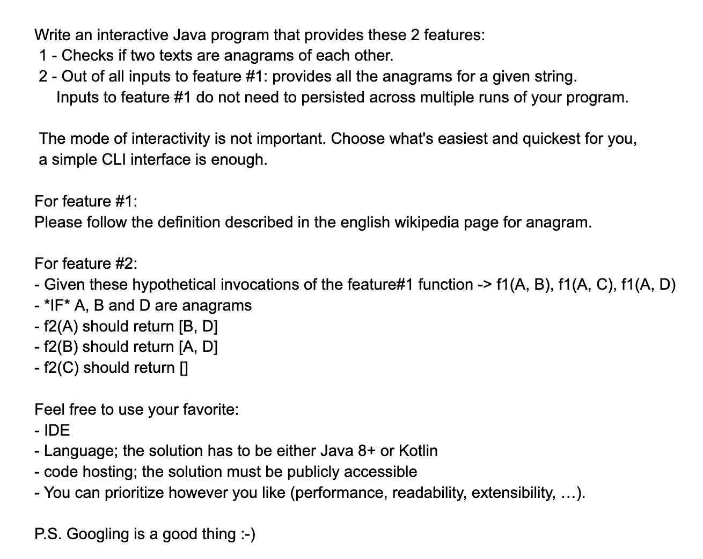

# Beyonnex Challenge
The challenge is defined in following picture:




## Running the console application
In order to run the program, just execute following command:

```
./run_app.sh
```

## Technical Details
In order to compile the code a JDK with java version 21 is required.

The code is written with the idea to optimize on readability and extensibility, but not on performance.
The reason for the later one is that this is a console application and the size of the data set is limited by the amount
of inputs a given user can provide. Even if decided to change the implementation, we would just need to change one class.

What I tried to achieve were mainly following things:
1. Being able to quickly write a new test for functionality in any part of the code.
2. Separating functionality of code into separate units in order to be able to easily extend and test new functionality.